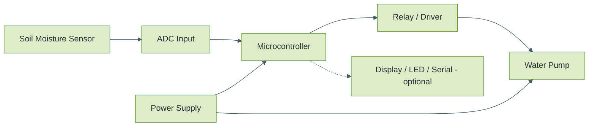
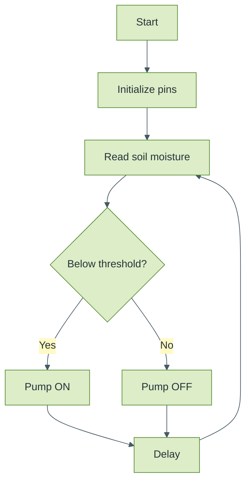

<div align="center">


### A sensor-based automatic irrigation controller that turns a water pump on when soil moisture drops below a set threshold.

    

</div>

<!-- Remove or edit any badge that does not match your actual project. Update [USERNAME] and every [PLACEHOLDER]. -->

## 📋 At a Glance

| 🧭 Domain | 🧰 Stack | 📈 Level |
|---|---|---|
| Embedded Systems / Agri-tech | Soil moisture sensor, Relay, Pump | Beginner |

<details>
<summary>📑 Table of Contents</summary>

- [📌 Overview](#-overview)
- [🎯 Problem Statement](#-problem-statement)
- [✨ Features](#-features)
- [🛠️ Technologies Used](#-technologies-used)
- [🧩 System Architecture (Block Diagram)](#-system-architecture-block-diagram)
- [⚙️ Working Principle](#-working-principle)
- [🔄 Control Flowchart](#-control-flowchart)
- [🔌 Hardware Requirements](#-hardware-requirements)
- [📍 Pin Mapping](#-pin-mapping)
- [🎚️ Calibration](#-calibration)
- [📁 Project Structure](#-project-structure)
- [🚀 Installation and Build Procedure](#-installation-and-build-procedure)
- [▶️ Usage](#-usage)
- [🧪 Testing](#-testing)
- [📸 Screenshots and Media](#-screenshots-and-media)
- [📊 Results](#-results)
- [⚠️ Limitations](#-limitations)
- [📚 Documentation](#-documentation)
- [🎤 Presentation Outline](#-presentation-outline)
- [🔮 Future Enhancements](#-future-enhancements)
- [📄 License](#-license)

</details>

---


## 📌 Overview
A soil moisture sensor is read by a `[MICROCONTROLLER]`. When the reading indicates dry soil, the controller switches a pump through a `[RELAY / TRANSISTOR DRIVER]` until the soil is sufficiently moist.

## 🎯 Problem Statement
Manual watering is time-consuming and often inconsistent, leading to over-watering or under-watering plants.

## ✨ Features
- [ ] Soil moisture sensing
- [ ] Threshold-based automatic pump control
- [ ] `[Status output: display / LED / serial. Keep only if used]`

## 🛠️ Technologies Used
| Area | Details |
|---|---|
| Microcontroller | [MODEL] |
| Sensor | [Soil moisture sensor, analog/digital] |
| Actuator | [Pump type and voltage] |
| Driver | [Relay module / transistor] |
| Language | [Embedded C / Arduino C++] |

## 🧩 System Architecture (Block Diagram)



## ⚙️ Working Principle
1. The sensor outputs a signal that changes with soil moisture.
2. The microcontroller reads it through `[ADC pin / digital pin]`.
3. The reading is compared with a threshold chosen from calibration (`[DRY VALUE]` dry, `[WET VALUE]` wet).
4. Below the threshold (dry), the pump is switched ON through the driver.
5. When moisture rises above the threshold, the pump is switched OFF.
6. The cycle repeats continuously with a `[DELAY]` between readings.

## 🔄 Control Flowchart



## 🔌 Hardware Requirements
| Component | Qty | Notes |
|---|---|---|
| [Microcontroller] | 1 | |
| Soil moisture sensor | 1 | |
| Relay module / driver | 1 | |
| Water pump | 1 | [VOLTAGE/CURRENT] |
| Power source | 1 | |
| Tubing, container, jumper wires | | |

> [!WARNING]
> Power the pump from a suitable external supply through a relay or driver. Never drive it directly from a microcontroller pin.

## 📍 Pin Mapping
| Signal | Pin |
|---|---|
| Sensor output | [PIN] |
| Relay/driver input | [PIN] |
| Status LED/display | [PIN] |

## 🎚️ Calibration
| Condition | Sensor Reading |
|---|---|
| Sensor in air | [MEASURE] |
| Dry soil | [MEASURE] |
| Wet soil | [MEASURE] |
Chosen threshold: `[VALUE]` because `[REASON]`.

## 📁 Project Structure
```
smart-plant-watering-system/
├── README.md
├── LICENSE
├── src/
├── docs/
│   ├── block_diagram.png
│   ├── circuit_diagram.png
│   ├── calibration_notes.md
│   ├── project_report.pdf
│   └── presentation/Smart_Plant_Watering.pptx
├── media/
└── tests/test_log.md
```

## 🚀 Installation and Build Procedure
1. Clone the repository.
2. Wire the circuit as per `docs/circuit_diagram.png`. Power the pump from a suitable supply, not from the microcontroller pin.
3. Open `src/[FILE]` in `[IDE]` and install `[LIBRARIES]`.
4. Run the calibration steps and note readings.
5. Set the threshold constant in code.
6. Upload and test with dry and wet soil.

## ▶️ Usage
Place the sensor in the soil and power the system. The pump runs automatically when the soil is dry and stops when moisture is adequate.

## 🧪 Testing
| Test | Condition | Expected | Observed | Result |
|---|---|---|---|---|
| Dry soil | Sensor in dry soil | Pump ON | [ADD] | |
| Wet soil | Sensor in wet soil | Pump OFF | [ADD] | |
| Transition | Add water gradually | Pump stops near threshold | [ADD] | |
| Sensor disconnected | Remove sensor | [Describe behavior] | [ADD] | |


## 🎤 Presentation Outline

<details>
<summary>View slide-by-slide outline</summary>

1. Title 2. Problem 3. Objectives 4. Block diagram 5. Components 6. Circuit 7. Working and flowchart 8. Calibration and threshold 9. Testing 10. Applications and limitations 11. Future scope 12. Conclusion

</details>

## 🔮 Future Enhancements
- [ ] Hysteresis to avoid rapid pump switching
- [ ] Maximum pump-on time as a safety limit
- [ ] Wi-Fi telemetry to AWS IoT (see `aws-iot-sensor-data-pipeline`)

## 👩‍💻 Author

<div align="center">

**Sai Sravani Addagiri** | B.Tech ECE | Lakireddy Bali Reddy College of Engineering

<a href="https://linkedin.com/in/sai-sravani-addagiri-147640291"></a> <a href="mailto:saisravani287@gmail.com"></a> <a href="https://github.com/[USERNAME]"></a>

</div>


<div align="center">

</div>
